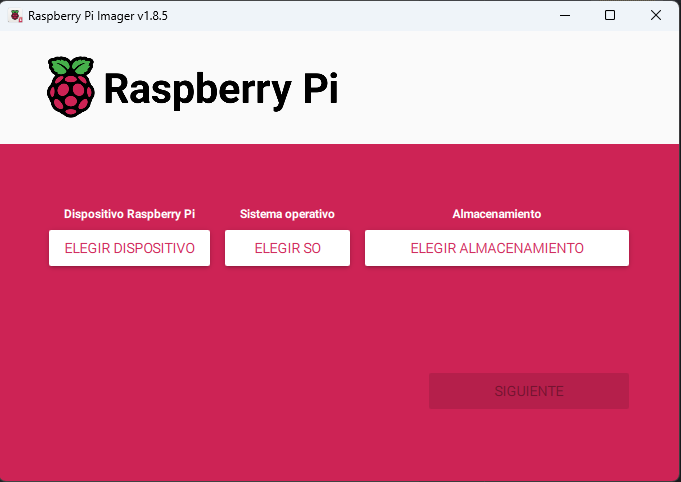
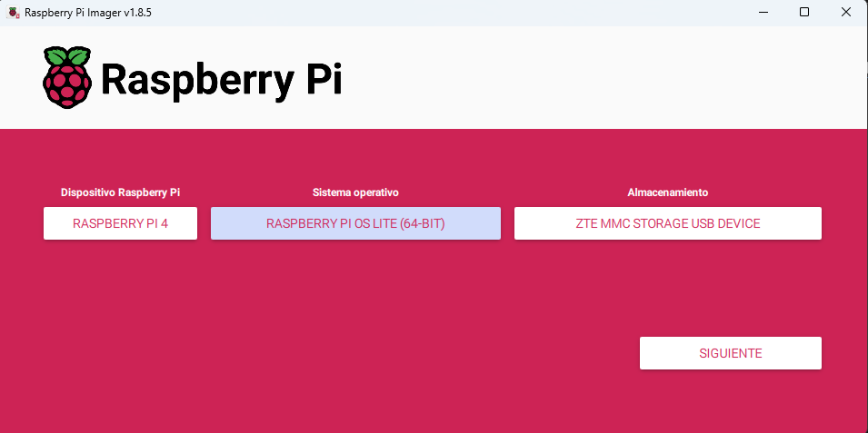
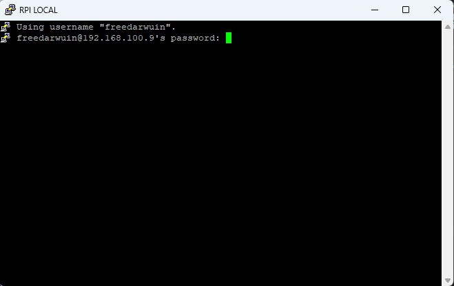

# phpnuxbill-install
Instalador de phpnuxbill automatico desde un bash en Raspberry PI

# Herramientas
1. Raspberry PI (Cualquier version)
2. Micro SD minimo 4GB
3. Software Raspberry Pi Imagen la pueden descargar en la siguiente dirección: [Descargar aquí](https://www.raspberrypi.com/software/)

## Primeros pasos

1. Instalar el sistema operativo Raspberry Pi en la Micro SD
2. Preparamos la Micro SD

Le damos siguiente y esperamos que finalice la instalación del sistema operativo en la Micro SD
3. Insertamos la Micro SD en la Raspberry Pi y esperamos que inicie el sistema operativo.

Ingresamos con el ususario

Sigue los siguientes pasos para cambiar tu contraseña del usuario root en tu servidor Linux (si conoces la actual):

Accede a tu servidor e inicia sesión con el usuario root.
Para cambiar la contraseña, introduce el siguiente comando desde un terminal:
   
    suso passwd
Inserta la nueva contraseña y repítela para finalizar el proceso.
La contraseña del usuario root se habrá cambiado.

Actualizar Raspberry Pi.

    sudo apt-get update
    sudo apt-get upgrade